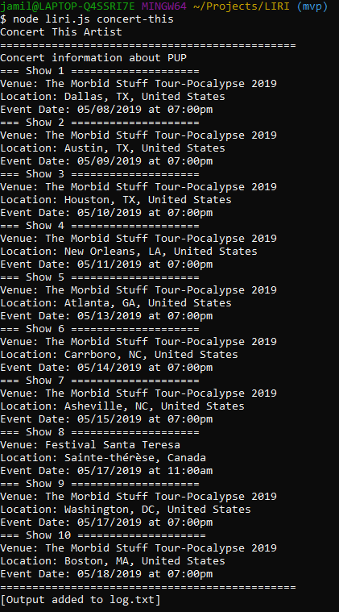
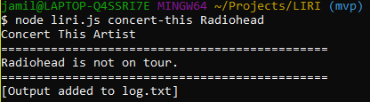
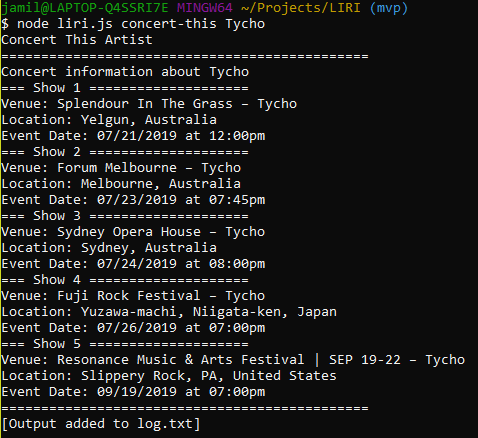
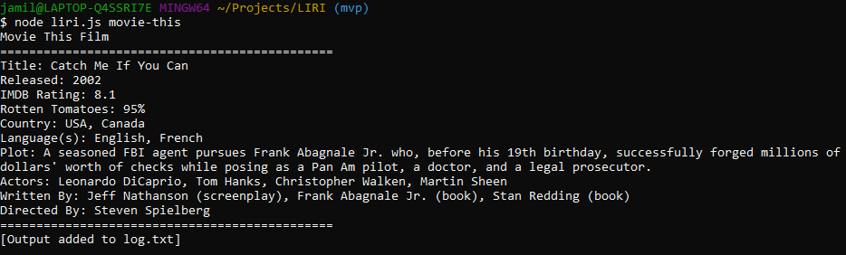
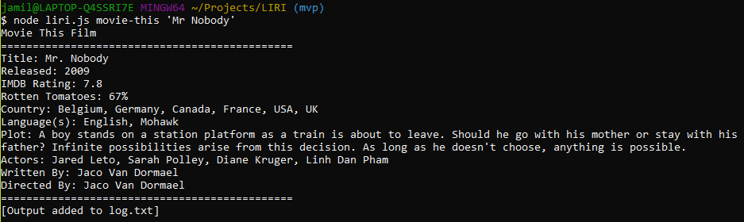
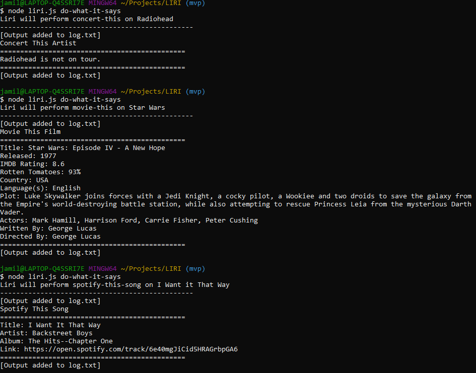
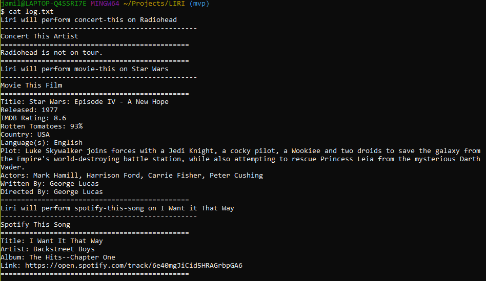

# LIRI
Language Interpretation and Recognition Interface made with Node.js
## Installation
Clone the repository to your computer and then navigate to the directory in the terminal. I used Git bash on Windows during testing.
## Spotify This Song
The default song is The Sign by Ace of Base  
`spotify-this-song`  
   
This is a demonstration of Sunflower by Post-Malone  
`spotify-this-song sunflower`  

## Concert This Artist
The default artist is PUP.  
`concert-this`  
  
Radiohead has no shows.  
`concert-this Radiohead`  
  
Tycho seems to be on a short tour.  
`concert-this Tycho`  

## Movie This Film
Catch Me If You Can (My favorite film) is the default input.  
`movie-this`  

`movie-this 'Mr. Nobody'`  

## Do What It Says
Each line of random.txt is a different command and argument. When LIRI is asked to `do-what-it-says`, the contents of random.txt are split at the line break and then passed through the switch case function.  
Here is the output after the command has run three times.  

## Usage Log
After each use of LIRI, the output is recorded to log.txt  
Here is log.txt after the above three `do-what-it-says` commands.  

## Problems and Solutions
- Formatting random.txt (Do what)
    - `concert-this "Radiohead"` vs. `concert-this Radiohead`: This was a problem with the bandsintown API. It would not accept quotes in the input. To solve this, the quotes are sliced from the input string like so, `inputString.slice(1, -1)`.
- The bandsintown API returned a lot of data so I created an object called `showSnippet` that took a maximum of 10 shows from the response.
    - Using the `Object.keys()` method on `showSnippet` allowed me to use the `forEach` method on the array of properties and produce an output with important information.  
- This was the first CLI app I have ever written and had never used Regex and characters like newline (`\n`)
## Inquirer Implementation
Inquirer JS allows the app to remove a reliance on the `process.argv` array. 
## Author
- Owais Jamil