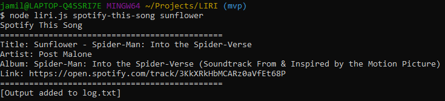

# LIRI
Language Interpretation and Recognition Interface made with Node.js
## Installation
Clone the repository to your computer and then navigate to the directory in the terminal. I used Git bash on Windows during testing.
## Spotify This Song
`spotify-this-song` 
 
   
`spotify-this-song sunflower` 
   

## Concert This Artist
- *Default*: PUP (Currently on tour)
- Not on tour: Radiohead
- On tour: The Menzingers
- Few Shows: Tycho
- SCREENSHOT OF ALL OF THESE
## Movie This Film
- *Default*: Catch Me If You Can
- SCREENSHOT DEFAULT
- SCREENSHOT Mr. Nobody
## Do What It Says
- Each line of random.txt is a different command and argument. When LIRI is asked to `do-what-it-says`, the contents of random.txt are split at the line break and then passed through the switch case function. 
- SCREENSHOT OF USE
## Usage Log
- After each use of LIRI, the output is recorded to log.txt
- SCREENSHOT OF `log.txt` after each use of LIRI
## Problems and Solutions
- Formatting random.txt (Do what)
    - `concert-this "Radiohead"` vs. `concert-this Radiohead`
- Working with objects and treating like arrays (Concert this)
- Using console.log and formatting outputs
## Author
- Owais Jamil